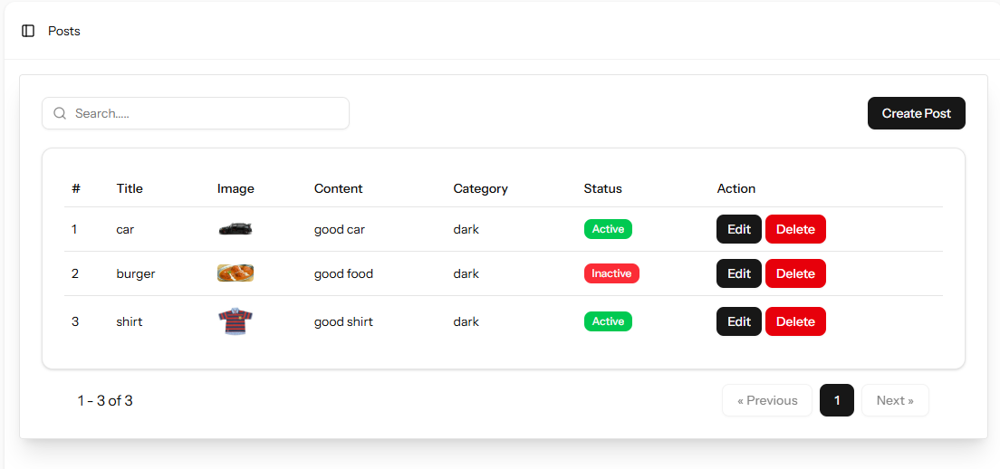
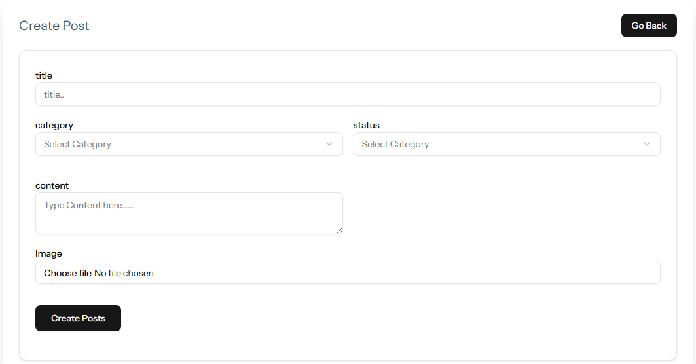
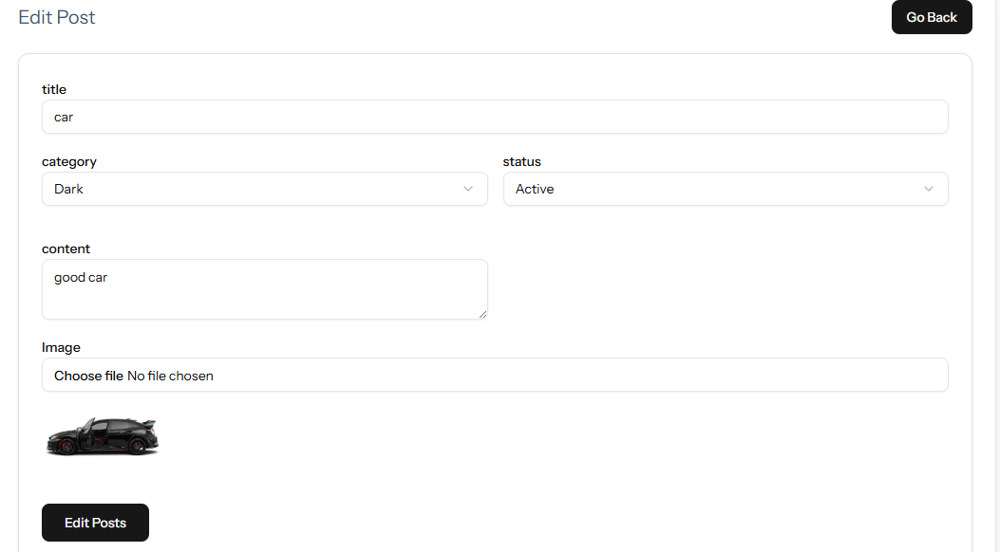

# 📌 Post Management System (Laravel + Inertia.js)

This is a simple **Post Management System** built with **Laravel**, **Inertia.js**, and **React/Vue (depending on your setup)**.  
It allows authenticated users to create, edit, update, and delete posts with image uploads.  

---

## 🚀 Features

- ✅ User authentication (only logged-in users can manage posts)  
- ✅ Create, read, update, and delete (CRUD) posts  
- ✅ Upload and manage images for posts  
- ✅ Search posts by title or content  
- ✅ Pagination support (5 posts per page)  
- ✅ Slug generation for clean URLs  
- ✅ Categories and status support for posts  
- ✅ Uses Laravel’s `Storage` for file handling  

---

## 📂 Project Structure

- **Controllers**  
  - `PostController.php` – Handles CRUD operations for posts.  

- **Models**  
  - `Post.php` – Post model with relationships to `User`.  

- **Frontend (Inertia.js)**  
  - `resources/js/Pages/posts/Index.tsx` – List all posts  
  - `resources/js/Pages/posts/Create.tsx` – Create new post form  
  - `resources/js/Pages/posts/Edit.tsx` – Edit post form  

---

## 🛠️ Installation

### 1. Clone the repository
```bash
git clone https://github.com/your-username/post-management-system.git
cd post-management-system
2. Install dependencies
bash
Copy code
composer install
npm install && npm run build

3. Configure .env
env
Copy code
APP_NAME="Post Management"
APP_ENV=local
APP_KEY=base64:...
APP_DEBUG=true
APP_URL=http://localhost

DB_CONNECTION=mysql
DB_HOST=127.0.0.1
DB_PORT=3306
DB_DATABASE=post_management
DB_USERNAME=root
DB_PASSWORD=

FILESYSTEM_DISK=public
4. Run migrations
bash
Copy code
php artisan migrate
5. Link storage
bash
Copy code
php artisan storage:link
6. Start the server
bash
Copy code
php artisan serve
Now visit: http://localhost:8000

📝 Usage
Login or register a new user.

Navigate to Posts.

Create a new post with title, content, category, status, and image.

Edit or delete existing posts.

Use the search bar to filter posts by title/content.

📸 Example Screens
### 📝 Post List
View all posts with pagination.  


---

### ➕ Create Post
Add a new post with image upload.  


---

### ✏️ Edit Post
Update existing post details.  

⚙️ Tech Stack
Backend: Laravel 12

Frontend: Inertia.js + React/Vue

Database: MySQL

Auth: Laravel Breeze/Jetstream (depending on setup)

File Storage: Laravel Storage (public disk)

🤝 Contributing
Pull requests are welcome! For major changes, please open an issue first to discuss what you’d like to change.

📄 License
This project is open-source and available under the MIT License.


